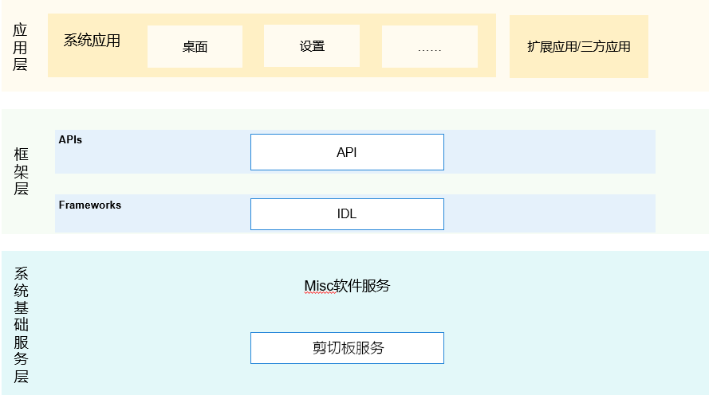

# 剪贴板组件<a name="ZH-CN_TOPIC_0000001115554184"></a>

-   [简介](#section11660541593)
-   [目录](#section161941989596)
-   [说明](#section38521239153117)
    -   [js接口说明](#section11908203714422)
    -   [js接口使用说明](#section9938411124317)

-   [相关仓](#section1371113476307)

## 简介<a name="section11660541593"></a>

剪贴板组件提供管理系统剪贴板的能力。

**图 1**  子系统架构图<a name="fig143011012341"></a>  


## 目录<a name="section161941989596"></a>

```
/base/miscservices/time
├── etc                      # 组件包含的进程的配置文件
├── figures                  # 构架图
├── framework                # innerKit接口
├── interfaces               # 组件对外提供的接口代码
│   └── kits                 # 对应用提供的接口
├── profile                  # 组件包含的系统服务的配置文件
├── services                 # 剪贴板服务实现
│    └── core                # 核心代码实现
│    └── test                # native测试代码
│    └── zidl                # 跨进程通信代码实现
├── utils                    # 测试或服务使用mock的数据
└──README_zh.md              # 使用说明
```

## 说明<a name="section38521239153117"></a>

### js接口说明<a name="section11908203714422"></a>

**表 1**   js组件PasteBoard开放的主要方法

<a name="table033515471012"></a>

<table><thead align="left"><tr id="row143351854201012"><th class="cellrowborder" valign="top" width="50%" id="mcps1.2.3.1.1"><p id="p103351154121010"><a name="p103351154121010"></a><a name="p103351154121010"></a>接口名</p>
</th>
<th class="cellrowborder" valign="top" width="50%" id="mcps1.2.3.1.2"><p id="p1033585416105"><a name="p1033585416105"></a><a name="p1033585416105"></a>描述</p>
</th>
</tr>
</thead>
<tbody><tr id="row204321219393"><td class="cellrowborder" valign="top" width="50%" headers="mcps1.2.3.1.1 "><p id="p1893413268144"><a name="p1893413268144"></a><a name="p1893413268144"></a>function createHtmlData(htmlText: string): PasteData;</p>
</td>
<td class="cellrowborder" valign="top" width="50%" headers="mcps1.2.3.1.2 "><p id="p18761104812149"><a name="p18761104812149"></a><a name="p18761104812149"></a>为 PasteData#MIMETYPE_TEXT_HTML 创建一个 PasteData 对象/p>
</td>
</tr>
<tr id="row13335054111018"><td class="cellrowborder" valign="top" width="50%" headers="mcps1.2.3.1.1 "><p id="p12832214151418"><a name="p12832214151418"></a><a name="p12832214151418"></a>function createWantData(want: Want): PasteData;</p>
</td>
<td class="cellrowborder" valign="top" width="50%" headers="mcps1.2.3.1.2 "><p id="p3335145451011"><a name="p3335145451011"></a><a name="p3335145451011"></a>为 PasteData#MIMETYPE_TEXT_WANT 创建一个 PasteData 对象</p>
</td>
</tr>
<tr id="row204321219393"><td class="cellrowborder" valign="top" width="50%" headers="mcps1.2.3.1.1 "><p id="p1893413268144"><a name="p1893413268144"></a><a name="p1893413268144"></a>function createPlainTextData(text: string): PasteData</p>
</td>
<td class="cellrowborder" valign="top" width="50%" headers="mcps1.2.3.1.2 "><p id="p18761104812149"><a name="p18761104812149"></a><a name="p18761104812149"></a>为 PasteData##MIMETYPE_TEXT_PLAIN 创建一个 PasteData 对象</p>
</td>
</tr>
<tr id="row204321219393"><td class="cellrowborder" valign="top" width="50%" headers="mcps1.2.3.1.1 "><p id="p1893413268144"><a name="p1893413268144"></a><a name="p1893413268144"></a>function createUriData(uri: string): PasteData;</p>
</td>
<td class="cellrowborder" valign="top" width="50%" headers="mcps1.2.3.1.2 "><p id="p18761104812149"><a name="p18761104812149"></a><a name="p18761104812149"></a>为 PasteData###MIMETYPE_TEXT_URI 创建一个 PasteData 对象</p>
</td>
</tr>
<tr id="row204321219393"><td class="cellrowborder" valign="top" width="50%" headers="mcps1.2.3.1.1 "><p id="p1893413268144"><a name="p1893413268144"></a><a name="p1893413268144"></a>function createHtmlTextRecord(htmlText: string): PasteDataRecord;</p>
</td>
<td class="cellrowborder" valign="top" width="50%" headers="mcps1.2.3.1.2 "><p id="p18761104812149"><a name="p18761104812149"></a><a name="p18761104812149"></a>为 PasteData#MIMETYPE_TEXT_HTML 创建一个 Record 对象</p>
</td>
</tr>
<tr id="row204321219393"><td class="cellrowborder" valign="top" width="50%" headers="mcps1.2.3.1.1 "><p id="p1893413268144"><a name="p1893413268144"></a><a name="p1893413268144"></a>function createWantRecord(want: Want): PasteDataRecord;</p>
</td>
<td class="cellrowborder" valign="top" width="50%" headers="mcps1.2.3.1.2 "><p id="p18761104812149"><a name="p18761104812149"></a><a name="p18761104812149"></a>为 PasteData#MIMETYPE_TEXT_WANT 创建一个 Record 对象</p>
</td>
</tr>
<tr id="row204321219393"><td class="cellrowborder" valign="top" width="50%" headers="mcps1.2.3.1.1 "><p id="p1893413268144"><a name="p1893413268144"></a><a name="p1893413268144"></a>function createPlainTextRecord(text: string): PasteDataRecord;</p>
</td>
<td class="cellrowborder" valign="top" width="50%" headers="mcps1.2.3.1.2 "><p id="p18761104812149"><a name="p18761104812149"></a><a name="p18761104812149"></a>为 PasteData#MIMETYPE_TEXT_PLAIN 创建一个 Record 对象</p>
</td>
</tr>
<tr id="row204321219393"><td class="cellrowborder" valign="top" width="50%" headers="mcps1.2.3.1.1 "><p id="p1893413268144"><a name="p1893413268144"></a><a name="p1893413268144"></a>function createUriRecord(uri: string): PasteDataRecord;</p>
</td>
<td class="cellrowborder" valign="top" width="50%" headers="mcps1.2.3.1.2 "><p id="p18761104812149"><a name="p18761104812149"></a><a name="p18761104812149"></a>为 PasteData#MIMETYPE_TEXT_URI 创建一个 Record 对象</p>
</td>
</tr>
<tr id="row204321219393"><td class="cellrowborder" valign="top" width="50%" headers="mcps1.2.3.1.1 "><p id="p1893413268144"><a name="p1893413268144"></a><a name="p1893413268144"></a>function getSystemPasteboard(): SystemPasteboard</p>
</td>
<td class="cellrowborder" valign="top" width="50%" headers="mcps1.2.3.1.2 "><p id="p18761104812149"><a name="p18761104812149"></a><a name="p18761104812149"></a>获取系统剪贴板</p>
</td>
</tr>
</tbody>
</table>


**表 2**  js组件SystemPasteboard开放的主要方法

<a name="table033515471012"></a>

<table><thead align="left"><tr id="row143351854201012"><th class="cellrowborder" valign="top" width="50%" id="mcps1.2.3.1.1"><p id="p103351154121010"><a name="p103351154121010"></a><a name="p103351154121010"></a>接口名</p>
</th>
<th class="cellrowborder" valign="top" width="50%" id="mcps1.2.3.1.2"><p id="p1033585416105"><a name="p1033585416105"></a><a name="p1033585416105"></a>描述</p>
</th>
</tr>
</thead>
<tbody><tr id="row204321219393"><td class="cellrowborder" valign="top" width="50%" headers="mcps1.2.3.1.1 "><p id="p1893413268144"><a name="p1893413268144"></a><a name="p1893413268144"></a>function on(type:'update', callback: () => void): void;</p>
</td>
<td class="cellrowborder" valign="top" width="50%" headers="mcps1.2.3.1.2 "><p id="p18761104812149"><a name="p18761104812149"></a><a name="p18761104812149"></a>粘贴板内容更改时调用的回调</p>
</td>
</tr>
<tr id="row13335054111018"><td class="cellrowborder" valign="top" width="50%" headers="mcps1.2.3.1.1 "><p id="p12832214151418"><a name="p12832214151418"></a><a name="p12832214151418"></a>function off(type: 'update', callback?: () => void): void</p>
</td>
<td class="cellrowborder" valign="top" width="50%" headers="mcps1.2.3.1.2 "><p id="p3335145451011"><a name="p3335145451011"></a><a name="p3335145451011"></a>粘贴板内容更改时调用的回调</p>
</td>
</tr>
<tr id="row204321219393"><td class="cellrowborder" valign="top" width="50%" headers="mcps1.2.3.1.1 "><p id="p1893413268144"><a name="p1893413268144"></a><a name="p1893413268144"></a>function clear(callback: AsyncCallback<void>): void</p>
</td>
<td class="cellrowborder" valign="top" width="50%" headers="mcps1.2.3.1.2 "><p id="p18761104812149"><a name="p18761104812149"></a><a name="p18761104812149"></a>清除剪贴板</p>
</td>
</tr>
<tr id="row204321219393"><td class="cellrowborder" valign="top" width="50%" headers="mcps1.2.3.1.1 "><p id="p1893413268144"><a name="p1893413268144"></a><a name="p1893413268144"></a>function clear(): Promise<void>;</p>
</td>
<td class="cellrowborder" valign="top" width="50%" headers="mcps1.2.3.1.2 "><p id="p18761104812149"><a name="p18761104812149"></a><a name="p18761104812149"></a>清除剪贴板</p>
</td>
</tr>
<tr id="row204321219393"><td class="cellrowborder" valign="top" width="50%" headers="mcps1.2.3.1.1 "><p id="p1893413268144"><a name="p1893413268144"></a><a name="p1893413268144"></a>function getPasteData(callback: AsyncCallback&lt;PasteData&gt;): void</p>
</td>
<td class="cellrowborder" valign="top" width="50%" headers="mcps1.2.3.1.2 "><p id="p18761104812149"><a name="p18761104812149"></a><a name="p18761104812149"></a>获取系统剪贴板数据对象</p>
</td>
</tr>
<tr id="row204321219393"><td class="cellrowborder" valign="top" width="50%" headers="mcps1.2.3.1.1 "><p id="p1893413268144"><a name="p1893413268144"></a><a name="p1893413268144"></a>function getPasteData():Promise&lt;PasteData&gt;</p>
</td>
<td class="cellrowborder" valign="top" width="50%" headers="mcps1.2.3.1.2 "><p id="p18761104812149"><a name="p18761104812149"></a><a name="p18761104812149"></a>获取系统剪贴板数据对象</p>
</td>
</tr>
<tr id="row204321219393"><td class="cellrowborder" valign="top" width="50%" headers="mcps1.2.3.1.1 "><p id="p1893413268144"><a name="p1893413268144"></a><a name="p1893413268144"></a>function hasPasteData(callback: AsyncCallback&lt;boolean&gt:void;</p>
</td>
<td class="cellrowborder" valign="top" width="50%" headers="mcps1.2.3.1.2 "><p id="p18761104812149"><a name="p18761104812149"></a><a name="p18761104812149"></a>检查粘贴板中是否有内容</p>
</td>
</tr>
<tr id="row204321219393"><td class="cellrowborder" valign="top" width="50%" headers="mcps1.2.3.1.1 "><p id="p1893413268144"><a name="p1893413268144"></a><a name="p1893413268144"></a>function hasPasteData(): Promise&lt;boolean&gt;</p>
</td>
<td class="cellrowborder" valign="top" width="50%" headers="mcps1.2.3.1.2 "><p id="p18761104812149"><a name="p18761104812149"></a><a name="p18761104812149"></a>检查粘贴板中是否有内容</p>
</td>
</tr>
<tr id="row204321219393"><td class="cellrowborder" valign="top" width="50%" headers="mcps1.2.3.1.1 "><p id="p1893413268144"><a name="p1893413268144"></a><a name="p1893413268144"></a>function setPasteData(data: PasteData, callback: AsyncCallback&lt;void&gt:void;</p>
</td>
<td class="cellrowborder" valign="top" width="50%" headers="mcps1.2.3.1.2 "><p id="p18761104812149"><a name="p18761104812149"></a><a name="p18761104812149"></a>将 PasteData 写入粘贴板</p>
</td>
</tr>
<tr id="row204321219393"><td class="cellrowborder" valign="top" width="50%" headers="mcps1.2.3.1.1 "><p id="p1893413268144"><a name="p1893413268144"></a><a name="p1893413268144"></a>function setPasteData(data: PasteData): Promise&lt;void&gt;</p>
</td>
<td class="cellrowborder" valign="top" width="50%" headers="mcps1.2.3.1.2 "><p id="p18761104812149"><a name="p18761104812149"></a><a name="p18761104812149"></a>将 PasteData 写入粘贴板</p>
</td>
</tr>
</tbody>
</table>


**表 3**  js组件PasteData开放的主要方法

<a name="table033515471012"></a>

<table><thead align="left"><tr id="row143351854201012"><th class="cellrowborder" valign="top" width="50%" id="mcps1.2.3.1.1"><p id="p103351154121010"><a name="p103351154121010"></a><a name="p103351154121010"></a>接口名</p>
</th>
<th class="cellrowborder" valign="top" width="50%" id="mcps1.2.3.1.2"><p id="p1033585416105"><a name="p1033585416105"></a><a name="p1033585416105"></a>描述</p>
</th>
</tr>
</thead>
<tbody><tr id="row204321219393"><td class="cellrowborder" valign="top" width="50%" headers="mcps1.2.3.1.1 "><p id="p1893413268144"><a name="p1893413268144"></a><a name="p1893413268144"></a>function addHtmlRecord(htmlText: string): void;</p>
</td>
<td class="cellrowborder" valign="top" width="50%" headers="mcps1.2.3.1.2 "><p id="p18761104812149"><a name="p18761104812149"></a><a name="p18761104812149"></a>将 HTML 文本记录添加到 PasteData 对象，并将 MIME 类型更新为 DataProperty 中的 PasteData#MIMETYPE_TEXT_HTML。</p>
</td>
</tr>
<tr id="row13335054111018"><td class="cellrowborder" valign="top" width="50%" headers="mcps1.2.3.1.1 "><p id="p12832214151418"><a name="p12832214151418"></a><a name="p12832214151418"></a>function addWantRecord(want: Want): void;</p>
</td>
<td class="cellrowborder" valign="top" width="50%" headers="mcps1.2.3.1.2 "><p id="p3335145451011"><a name="p3335145451011"></a><a name="p3335145451011"></a>将需要记录添加到 PasteData 对象，并将 MIME 类型更新为 DataProperty 中的 PasteData#MIMETYPE_TEXT_WANT</p>
</td>
</tr>
<tr id="row204321219393"><td class="cellrowborder" valign="top" width="50%" headers="mcps1.2.3.1.1 "><p id="p1893413268144"><a name="p1893413268144"></a><a name="p1893413268144"></a>function addRecord(record: PasteDataRecord): void;</p>
</td>
<td class="cellrowborder" valign="top" width="50%" headers="mcps1.2.3.1.2 "><p id="p18761104812149"><a name="p18761104812149"></a><a name="p18761104812149"></a>将 PasteRecord 添加到粘贴数据对象并更新数据属性中的 MIME 类型</p>
</td>
</tr>
<tr id="row204321219393"><td class="cellrowborder" valign="top" width="50%" headers="mcps1.2.3.1.1 "><p id="p1893413268144"><a name="p1893413268144"></a><a name="p1893413268144"></a>function addTextRecord(text: string): void;;</p>
</td>
<td class="cellrowborder" valign="top" width="50%" headers="mcps1.2.3.1.2 "><p id="p18761104812149"><a name="p18761104812149"></a><a name="p18761104812149"></a>将纯文本记录添加到 PasteData 对象，并将 MIME 类型更新为 DataProperty 中的 PasteData#MIMETYPE_TEXT_PLAIN</p>
</td>
</tr>
<tr id="row204321219393"><td class="cellrowborder" valign="top" width="50%" headers="mcps1.2.3.1.1 "><p id="p1893413268144"><a name="p1893413268144"></a><a name="p1893413268144"></a>function addUriRecord(uri: string): void;</p>
</td>
<td class="cellrowborder" valign="top" width="50%" headers="mcps1.2.3.1.2 "><p id="p18761104812149"><a name="p18761104812149"></a><a name="p18761104812149"></a>将 URI 记录添加到 PasteData 对象，并将 MIME 类型更新为 DataProperty 中的 PasteData#MIMETYPE_TEXT_URI</p>
</td>
</tr>
<tr id="row204321219393"><td class="cellrowborder" valign="top" width="50%" headers="mcps1.2.3.1.1 "><p id="p1893413268144"><a name="p1893413268144"></a><a name="p1893413268144"></a>function getMimeTypes(): Array&lt;string&gt;</p>
</td>
<td class="cellrowborder" valign="top" width="50%" headers="mcps1.2.3.1.2 "><p id="p18761104812149"><a name="p18761104812149"></a><a name="p18761104812149"></a>粘贴板上所有内容的 MIME 类型</p>
</td>
</tr>
<tr id="row204321219393"><td class="cellrowborder" valign="top" width="50%" headers="mcps1.2.3.1.1 "><p id="p1893413268144"><a name="p1893413268144"></a><a name="p1893413268144"></a>function getPrimaryHtml(): string;</p>
</td>
<td class="cellrowborder" valign="top" width="50%" headers="mcps1.2.3.1.2 "><p id="p18761104812149"><a name="p18761104812149"></a><a name="p18761104812149"></a>PasteData 对象中主要记录的 HTML 文本</p>
</td>
</tr>
<tr id="row204321219393"><td class="cellrowborder" valign="top" width="50%" headers="mcps1.2.3.1.1 "><p id="p1893413268144"><a name="p1893413268144"></a><a name="p1893413268144"></a>function getPrimaryWant(): Want;</p>
</td>
<td class="cellrowborder" valign="top" width="50%" headers="mcps1.2.3.1.2 "><p id="p18761104812149"><a name="p18761104812149"></a><a name="p18761104812149"></a>PasteData 对象中的主记录的want</p>
</td>
</tr>
<tr id="row204321219393"><td class="cellrowborder" valign="top" width="50%" headers="mcps1.2.3.1.1 "><p id="p1893413268144"><a name="p1893413268144"></a><a name="p1893413268144"></a>function getPrimaryMimeType(): string;</p>
</td>
<td class="cellrowborder" valign="top" width="50%" headers="mcps1.2.3.1.2 "><p id="p18761104812149"><a name="p18761104812149"></a><a name="p18761104812149"></a>PasteData 对象中主记录的 MIME 类型。</p>
</td>
</tr>
<tr id="row204321219393"><td class="cellrowborder" valign="top" width="50%" headers="mcps1.2.3.1.1 "><p id="p1893413268144"><a name="p1893413268144"></a><a name="p1893413268144"></a>function  getPrimaryUri(): string;</p>
</td>
<td class="cellrowborder" valign="top" width="50%" headers="mcps1.2.3.1.2 "><p id="p18761104812149"><a name="p18761104812149"></a><a name="p18761104812149"></a>PasteData 对象中主记录的 URI</p>
</td>
</tr>
<tr id="row204321219393"><td class="cellrowborder" valign="top" width="50%" headers="mcps1.2.3.1.1 "><p id="p1893413268144"><a name="p1893413268144"></a><a name="p1893413268144"></a>function  getProperty(): PasteDataProperty;</p>
</td>
<td class="cellrowborder" valign="top" width="50%" headers="mcps1.2.3.1.2 "><p id="p18761104812149"><a name="p18761104812149"></a><a name="p18761104812149"></a>获取剪贴板数据对象的属性</p>
</td>
</tr>
<tr id="row204321219393"><td class="cellrowborder" valign="top" width="50%" headers="mcps1.2.3.1.1 "><p id="p1893413268144"><a name="p1893413268144"></a><a name="p1893413268144"></a>function  getRecordAt(index: number): PasteDataRecord;</p>
</td>
<td class="cellrowborder" valign="top" width="50%" headers="mcps1.2.3.1.2 "><p id="p18761104812149"><a name="p18761104812149"></a><a name="p18761104812149"></a>基于指定索引的记录</p>
</td>
</tr>
<tr id="row204321219393"><td class="cellrowborder" valign="top" width="50%" headers="mcps1.2.3.1.1 "><p id="p1893413268144"><a name="p1893413268144"></a><a name="p1893413268144"></a>function  getRecordCount(): number;</p>
</td>
<td class="cellrowborder" valign="top" width="50%" headers="mcps1.2.3.1.2 "><p id="p18761104812149"><a name="p18761104812149"></a><a name="p18761104812149"></a>PasteData 对象中的记录数</p>
</td>
</tr>
<tr id="row204321219393"><td class="cellrowborder" valign="top" width="50%" headers="mcps1.2.3.1.1 "><p id="p1893413268144"><a name="p1893413268144"></a><a name="p1893413268144"></a>function  hasMimeType(mimeType: string): boolean;</p>
</td>
<td class="cellrowborder" valign="top" width="50%" headers="mcps1.2.3.1.2 "><p id="p18761104812149"><a name="p18761104812149"></a><a name="p18761104812149"></a>检查 DataProperty 中是否存在指定的 MIME 类型的数据</p>
</td>
</tr>
<tr id="row204321219393"><td class="cellrowborder" valign="top" width="50%" headers="mcps1.2.3.1.1 "><p id="p1893413268144"><a name="p1893413268144"></a><a name="p1893413268144"></a>function  removeRecordAt(index: number): boolean;</p>
</td>
<td class="cellrowborder" valign="top" width="50%" headers="mcps1.2.3.1.2 "><p id="p18761104812149"><a name="p18761104812149"></a><a name="p18761104812149"></a>根据指定索引删除记录</p>
</td>
</tr>
<tr id="row204321219393"><td class="cellrowborder" valign="top" width="50%" headers="mcps1.2.3.1.1 "><p id="p1893413268144"><a name="p1893413268144"></a><a name="p1893413268144"></a>function  replaceRecordAt(index: number, record: PasteDataRecord): boolean;</p>
</td>
<td class="cellrowborder" valign="top" width="50%" headers="mcps1.2.3.1.2 "><p id="p18761104812149"><a name="p18761104812149"></a><a name="p18761104812149"></a>用新记录替换指定记录</p>
</td>
</tr>
</tbody>
</table>


**表 4**  js组件PasteDataRecord开放的主要方法

<a name="table033515471012"></a>

<table><thead align="left"><tr id="row143351854201012"><th class="cellrowborder" valign="top" width="50%" id="mcps1.2.3.1.1"><p id="p103351154121010"><a name="p103351154121010"></a><a name="p103351154121010"></a>接口名</p>
</th>
<th class="cellrowborder" valign="top" width="50%" id="mcps1.2.3.1.2"><p id="p1033585416105"><a name="p1033585416105"></a><a name="p1033585416105"></a>描述</p>
</th>
</tr>
</thead>
<tbody><tr id="row204321219393"><td class="cellrowborder" valign="top" width="50%" headers="mcps1.2.3.1.1 "><p id="p1893413268144"><a name="p1893413268144"></a><a name="p1893413268144"></a>function convertToText(callback: AsyncCallback&lt;string&gt;): void;</p>
</td>
<td class="cellrowborder" valign="top" width="50%" headers="mcps1.2.3.1.2 "><p id="p18761104812149"><a name="p18761104812149"></a><a name="p18761104812149"></a>将 PasteData 转换为文本内容的内容</p>
</td>
</tr>
<tr id="row13335054111018"><td class="cellrowborder" valign="top" width="50%" headers="mcps1.2.3.1.1 "><p id="p12832214151418"><a name="p12832214151418"></a><a name="p12832214151418"></a>function convertToText():  Promise&lt;void&gt;</p>
</td>
<td class="cellrowborder" valign="top" width="50%" headers="mcps1.2.3.1.2 "><p id="p3335145451011"><a name="p3335145451011"></a><a name="p3335145451011"></a>将 PasteData 转换为文本内容的内容</p>
</td>
</tr>
</tbody>
</table>


**表 5**  PasteDataProperty组件参数说明

<a name="table033515471012"></a>

<table><thead align="left"><tr id="row143351854201012"><th class="cellrowborder" valign="top" width="30%" id="mcps1.2.3.1.1"><p id="p103351154121010"><a name="p103351154121010"></a><a name="p103351154121010"></a>名称</p>
</th>
<th class="cellrowborder" valign="top" width="30%" id="mcps1.2.3.1.2"><p id="p1033585416105"><a name="p1033585416105"></a><a name="p1033585416105"></a>类型</p>
</th>
<th class="cellrowborder" valign="top" width="40%" id="mcps1.2.3.1.3"><p id="p1033585416105"><a name="p1033585416105"></a><a name="p1033585416105"></a>说明</p>
</th>
</tr>
</thead>
<tbody><tr id="row204321219393"><td class="cellrowborder" valign="top" width="30%" headers="mcps1.2.3.1.1 "><p id="p1893413268144"><a name="p1893413268144"></a><a name="p1893413268144"></a>additions{[key:string]}</p>
</td>
<td class="cellrowborder" valign="top" width="30%" headers="mcps1.2.3.1.2 "><p id="p18761104812149"><a name="p18761104812149"></a><a name="p18761104812149"></a>object</p>
</td>
<td class="cellrowborder" valign="top" width="40%" headers="mcps1.2.3.1.3 "><p id="p18761104812149"><a name="p18761104812149"></a><a name="p18761104812149"></a>附加属性数据键值对</p>
</td>
</tr>
<tr id="row204321219393"><td class="cellrowborder" valign="top" width="30%" headers="mcps1.2.3.1.1 "><p id="p1893413268144"><a name="p1893413268144"></a><a name="p1893413268144"></a>mimeTypes</p>
</td>
<td class="cellrowborder" valign="top" width="30%" headers="mcps1.2.3.1.2 "><p id="p18761104812149"><a name="p18761104812149"></a><a name="p18761104812149"></a>Array<string></p>
</td>
<td class="cellrowborder" valign="top" width="40%" headers="mcps1.2.3.1.3 "><p id="p18761104812149"><a name="p18761104812149"></a><a name="p18761104812149"></a>PasteData 中所有记录的非重复 MIME 类型</p>
</td>
</tr>
<tr id="row204321219393"><td class="cellrowborder" valign="top" width="30%" headers="mcps1.2.3.1.1 "><p id="p1893413268144"><a name="p1893413268144"></a><a name="p1893413268144"></a>tag</p>
</td>
<td class="cellrowborder" valign="top" width="30%" headers="mcps1.2.3.1.2 "><p id="p18761104812149"><a name="p18761104812149"></a><a name="p18761104812149"></a>string</p>
</td>
<td class="cellrowborder" valign="top" width="40%" headers="mcps1.2.3.1.3 "><p id="p18761104812149"><a name="p18761104812149"></a><a name="p18761104812149"></a>PasteData 对象的用户定义标签</p>
</td>
</tr>
<tr id="row204321219393"><td class="cellrowborder" valign="top" width="30%" headers="mcps1.2.3.1.1 "><p id="p1893413268144"><a name="p1893413268144"></a><a name="p1893413268144"></a>timestamp</p>
</td>
<td class="cellrowborder" valign="top" width="30%" headers="mcps1.2.3.1.2 "><p id="p18761104812149"><a name="p18761104812149"></a><a name="p18761104812149"></a>number</p>
</td>
<td class="cellrowborder" valign="top" width="40%" headers="mcps1.2.3.1.3 "><p id="p18761104812149"><a name="p18761104812149"></a><a name="p18761104812149"></a>时间戳，指示何时将数据写入系统粘贴板。</p>
</td>
</tr>
<tr id="row204321219393"><td class="cellrowborder" valign="top" width="30%" headers="mcps1.2.3.1.1 "><p id="p1893413268144"><a name="p1893413268144"></a><a name="p1893413268144"></a>localOnly</p>
</td>
<td class="cellrowborder" valign="top" width="30%" headers="mcps1.2.3.1.2 "><p id="p18761104812149"><a name="p18761104812149"></a><a name="p18761104812149"></a> boolean</p>
</td>
<td class="cellrowborder" valign="top" width="40%" headers="mcps1.2.3.1.3 "><p id="p18761104812149"><a name="p18761104812149"></a><a name="p18761104812149"></a>检查 PasteData 是否设置为仅用于本地访问。</p>
</td>
</tr>
</tbody>
</table>

### js接口使用说明<a name="section9938411124317"></a>

剪贴板模块使用示例：

```
// 导入模块
import pasteboard from '@ohos.pasteboard'

console.log('Get SystemPasteboard')
var systemPasteboard = pasteboard.getSystemPasteboard()
		
var Text = 'Hello World !'
		
console.log('createUriRecord = ' + Text)
var pasteDataRecord = pasteboard.createPlainTextData(Text)
		
console.log('Check text of pasteDataRecord = ' + pasteDataRecord.plainText)
        
console.log('Clears the pasteboard')
systemPasteboard.clear()
		
console.log('Check text of pasteDataRecord = ""')

```


## 相关仓<a name="section1371113476307"></a>

**Misc软件服务子系统**

[miscservices\_paste](https://gitee.com/openharmony/miscservices_pasteboard/tree/master/)

